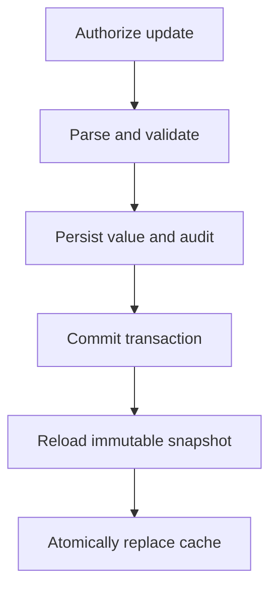

# Runtime settings operations

## Ownership boundary

The `system` module owns service-governance settings only: general rate limiting,
brute-force protection, persistent IP access policy, request logging, and security
auditing. IP policy includes temporary/permanent deny rules and optional allow rules
for protected administration endpoints. These runtime governance records are distinct
from trusted proxy networks: proxy CIDRs decide whether forwarded client-IP headers can
be trusted and remain startup configuration. Use the implemented IP-rule API and
OpenAPI for route and DTO details; the design does not specify them.

JWT keys, database connections, trusted proxy networks, CORS origins, and bootstrap
credentials are startup configuration and require a restart/deployment.

Business behavior stays with its owning module. Self-registration policy belongs to
`identity`; announcement publication policy belongs to `example`. Modules may reuse
the common typed-setting mechanism but own their keys, validation, API, and permission.

## Typed key registry

The registry defines keys for:

- general API rate-limit capacity and window;
- brute-force enabled state, failure threshold, observation window, and lock duration;
- request logging enabled state; and
- security auditing enabled state.

Each `SettingKey<T>` declares its Java type, default value, parser, validator, and
whether it applies immediately. Supported validation includes integer, boolean,
duration, and CIDR values. Consult `GET /api/v1/system/settings` and OpenAPI for exact
key strings, JSON shapes, defaults, and ranges; these names and numeric limits are not
specified by the design and must not be guessed.

Reading settings requires `system:config:read`; updating them under
`/api/v1/system/settings` requires `system:config:write`. Audit search is paginated at
`/api/v1/system/audit-events` and requires `system:audit:read`.

## Update and audit flow

An update stores normalized JSON using optimistic versioning and writes sanitized
before/after audit metadata in the same transaction. Only an after-commit callback
reloads and swaps the immutable snapshot. Unknown, malformed, or out-of-range values
are rejected; rollback leaves the previous in-memory snapshot active, so invalid values
never partially apply.

Operational procedure:

1. Read the current value and record version through the settings API.
2. Make one bounded change using the documented update DTO.
3. Confirm the API response and corresponding audit event (actor, action, target,
   result, timestamp, trace ID, and sanitized metadata).
4. Exercise the affected behavior from a non-privileged test client.
5. To roll back, submit the recorded prior value as another audited update.

Avoid toggling security auditing merely to reduce volume. Logs and audit metadata never
contain passwords, raw tokens, authorization headers, or sensitive bodies.

## Local-counter limitation and Redis extension

Rate-limit and brute-force counters are bounded, thread-safe in-memory state in the
first release. They disappear on restart and are not coordinated among replicas.
Persistent IP rules and account locks survive restarts, but per-instance counters mean
an effective cluster-wide threshold can be multiplied by the number of replicas.

For strict multi-instance enforcement, implement the narrow rate-limit and brute-force
counter-store interfaces with Redis (or another atomic shared store). Preserve key
normalization, expiration/window semantics, maximum cardinality controls, and atomic
increment/check behavior. Wire the adapter through configuration without changing
controllers or policies, then add concurrency, expiry, outage, and multi-instance
integration tests. Redis is an extension point, not included in this starter.
